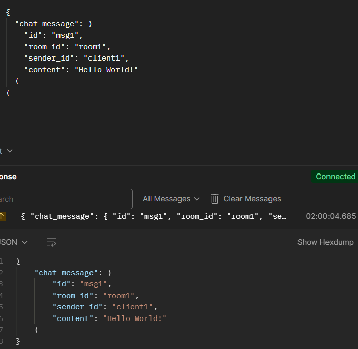
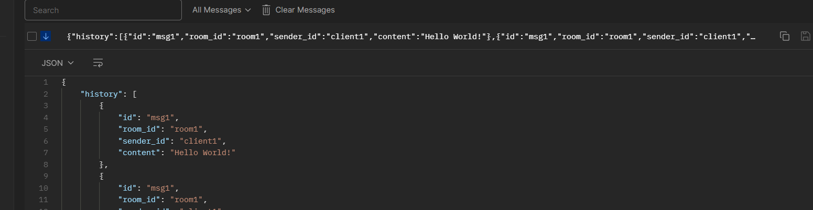
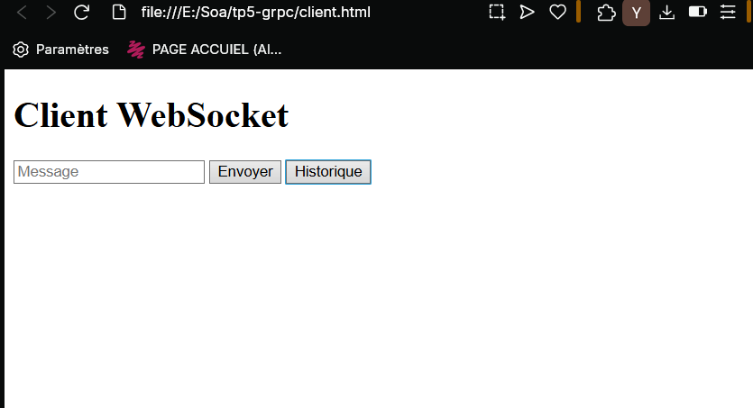
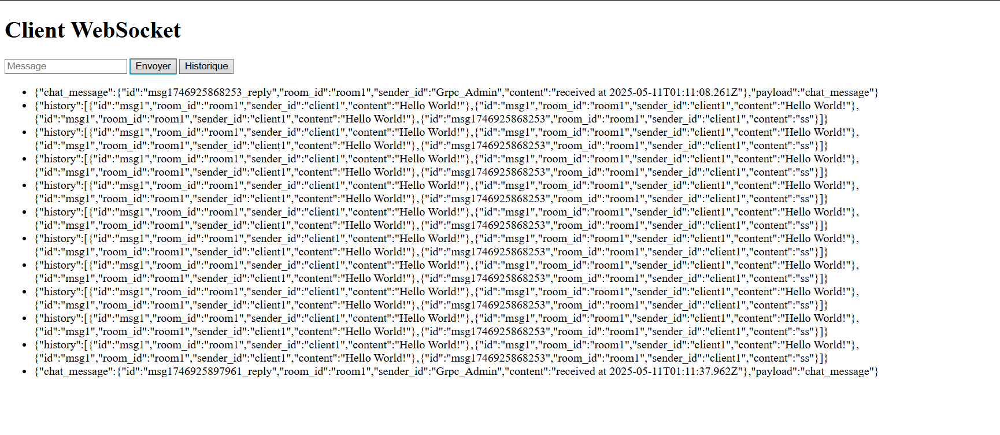

# TP5 : Reverse Proxy WebSocket avec gRPC

## 🧠 Objectif

Ce TP a pour objectif de mettre en place un **microservice gRPC** capable de gérer un service de chat, et de créer un **proxy WebSocket** pour relayer les messages en temps réel entre des clients Web et le backend gRPC.

---

## ⚙️ Technologies utilisées

- Node.js
- gRPC (`@grpc/grpc-js`, `@grpc/proto-loader`)
- WebSocket (`ws`)
- Protobuf v3
- HTML + JS (client Web)

---

## 📁 Structure du projet

```
tp5-grpc/
│
├── chat.proto         # Définition du service gRPC
├── server.js          # Serveur gRPC avec historique
├── proxy.js           # Reverse proxy WebSocket
├── client.html        # Client web pour le chat
└── package.json       # Dépendances du projet
```

---

## 🚀 Installation

```bash
git clone <lien-du-repo>
cd tp5-grpc
npm install
```

---

## ▶️ Lancement

1. **Lancer le serveur gRPC** :

```bash
node server.js
```

2. **Lancer le proxy WebSocket** (port 9090) :

```bash
node proxy.js
```


## 🧪 Test avec Postman

### 🔌 Connexion WebSocket

- Connecter à `ws://localhost:9090`



---

### 💬 Envoyer un message

```json
{
  "chat_message": {
    "id": "msg1",
    "room_id": "room1",
    "sender_id": "client1",
    "content": "Hello World!"
  }
}
```

✅ Réponse attendue :

```json
{
  "chat_message": {
    "id": "msg1_reply",
    "room_id": "room1",
    "sender_id": "Grpc_Admin",
    "content": "received at ..."
  }
}
```

📸 Capture :



---

### 📜 Récupérer l’historique

```json
{
  "type": "history"
}
```

📸 Capture :


---

## 🌐 Interface Web HTML

### `client.html` – Interface WebSocket simple

- Envoi de messages
- Affichage des messages
- Récupération de l'historique

📸 Capture :



---
